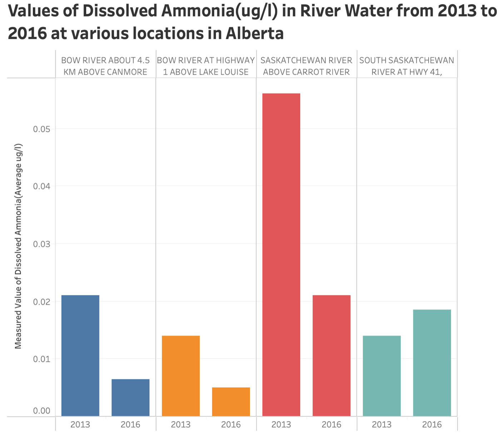
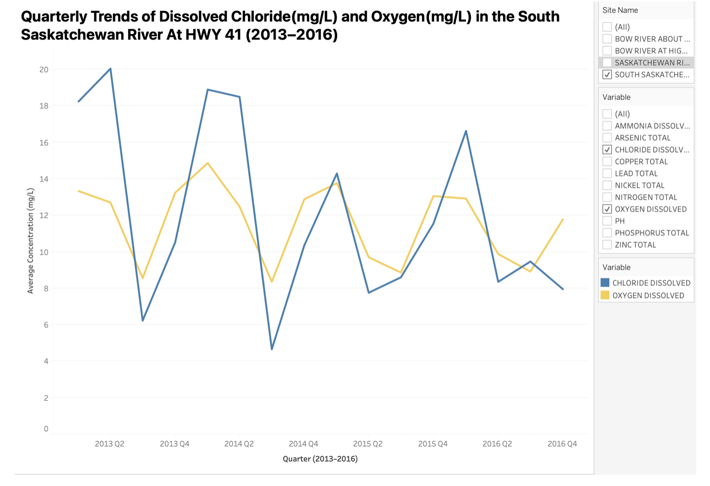
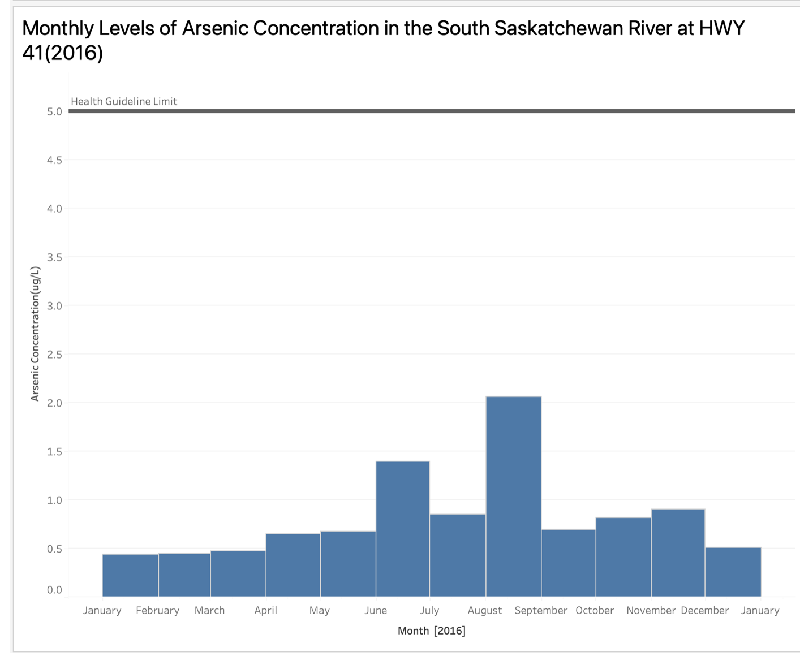
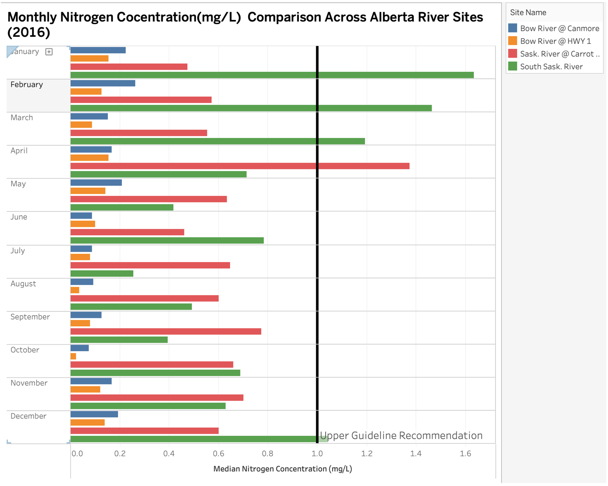
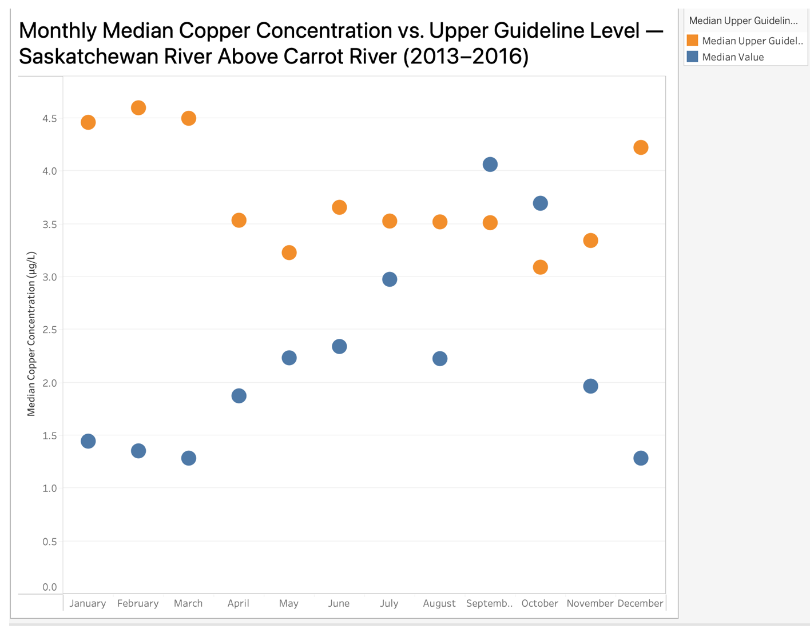

## River Water Quality Measurements Across Saskatchewan River Sites (2014–2017)
Dataset can be found under Images
(Images/dataset.csv) 

## Overview  
This dataset presents recorded measurements of key water quality indicators collected from multiple sampling sites along the Saskatchewan River system between 2014 and 2017. It includes chemical and physical parameters such as copper, nitrate, phosphorus, and other compounds that influence aquatic health and environmental quality. The goal of these visualizations is to analyze temporal and spatial variations in water quality across different sites, identify patterns of pollution or consistency in readings, and evaluate whether the levels fall within acceptable environmental guidelines over time.

 
## Tools  
- Tableau & Microsoft Excel  
- Built-in Tableau features for data cleaning, filtering, and aggregation  
- Microsoft Excel for preliminary data preparation and normalization  
- Dataset provided by the Government of Saskatchewan / Water Quality Monitoring Program

## Visualizations  

### Visualization 1  

### Visualization 2 

### Visualization 3

### Visualization 4 

### Visualization 5 

## Insights
- Dissolved ammonia levels were highest in 2013 across all Alberta river sites, particularly at the Saskatchewan River above Carrot River, suggesting localized pollution spikes during that year.  
- The South Saskatchewan River at HWY 41 showed fluctuating chloride and oxygen concentrations between 2013 and 2016, with inverse trends hinting at possible seasonal or discharge-related influences.  
- Arsenic concentrations in 2016 remained below the health guideline limit, although August exhibited a temporary increase, indicating potential short-term contamination events.  
- Nitrogen levels across Alberta river sites in 2016 varied seasonally, with several months nearing or slightly exceeding the upper guideline recommendation at the Saskatchewan and South Saskatchewan River sites.  
- Copper concentrations at the Saskatchewan River above Carrot River remained consistently below the upper guideline throughout 2013–2016, showing gradual improvement and stability in water quality conditions.
