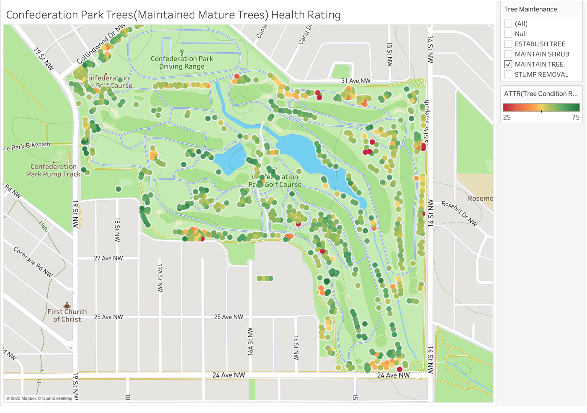
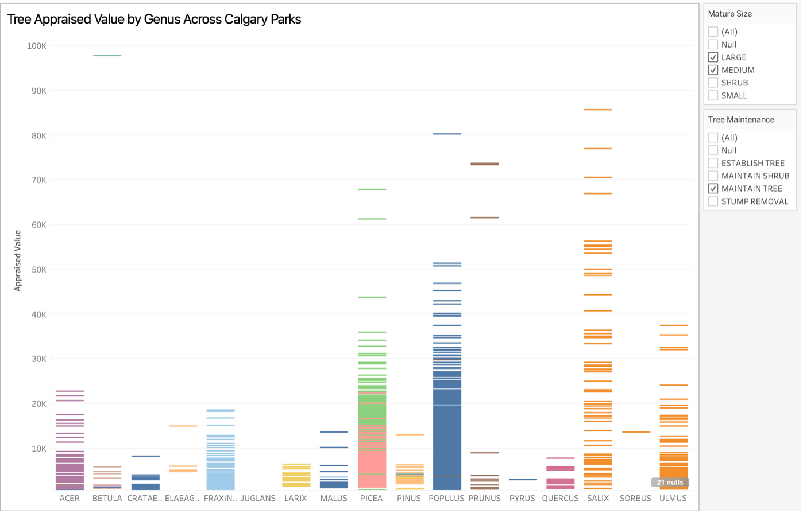
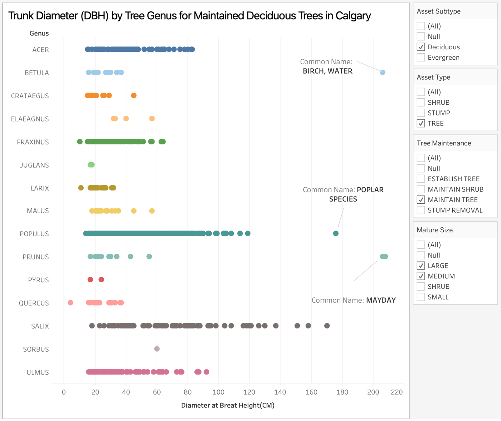
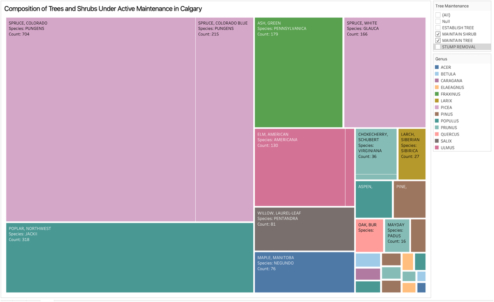
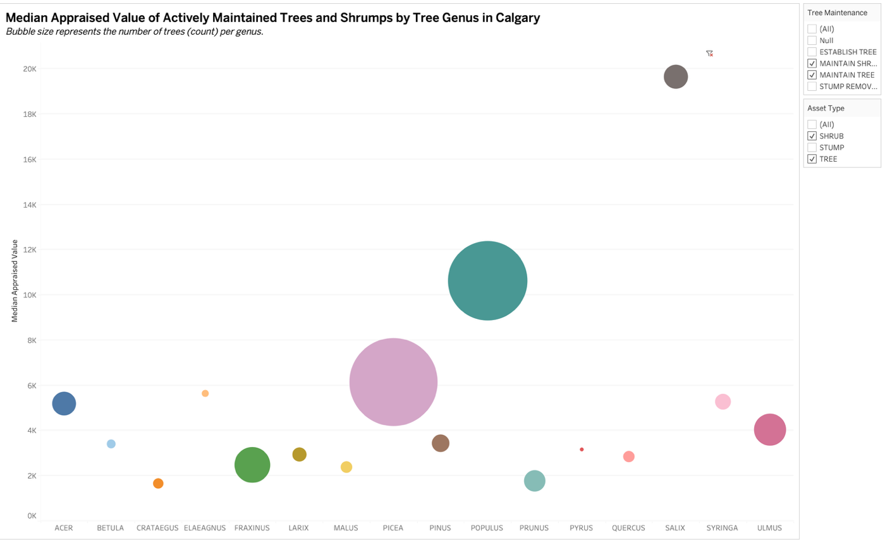

# 🌳 Urban Trees Maintained by Calgary Parks  
Dataset can be found under:  
(Images/dataset.csv) 

## Overview  
This dataset provides a comprehensive look into **Calgary’s urban forestry management**, focusing on trees and shrubs that are **actively maintained by the City of Calgary’s Parks and Urban Forestry Business Units**. Each record represents an individual tree asset, including details about its **species**, **genus**, **size (DBH)**, **health rating**, **appraised monetary value**, **maintenance activity**, and **geographic location**.  

Urban trees play a vital role in improving air quality, providing shade, enhancing biodiversity, and increasing property values. By maintaining an extensive database of these assets, the City of Calgary ensures a balance between **aesthetic urban design**, **environmental sustainability**, and **public safety**.  

The primary purpose of this visualization project is to use data storytelling to understand:  
- Which **tree species and genera dominate Calgary’s parks and neighborhoods**,  
- How **tree size and health (condition ratings)** relate to **appraised value**,  
- What **maintenance activities** (such as pruning, establishment, and stump removal) are most common, and  
- How the City distributes its **urban forestry resources** to preserve long-term canopy health.  

Through a series of Tableau visualizations, this dataset highlights spatial, biological, and economic patterns that reveal the scale and structure of Calgary’s managed green infrastructure. The findings provide insights not only into tree diversity but also into how **urban planning and ecological maintenance intersect** in one of Canada’s fastest-growing municipalities.

## Tools  
- Tableau & Microsoft Excel  
- Built-in Tableau features for data cleaning, filtering, and aggregation  
- Microsoft Excel for preliminary data preparation and normalization  
- Dataset provided by the City of Calgary 

## Visualizations  

### Visualization 1  

### Visualization 2 

### Visualization 3

### Visualization 4 

### Visualization 5 

## Insights
- Healthy trees are concentrated in major Calgary parks, with most mature trees showing strong condition ratings and only a few lower-health clusters near high-traffic areas.
- Poplar and Spruce trees hold the highest appraised values, indicating their importance to Calgary’s overall urban canopy and long-term maintenance focus.
- Deciduous trees such as Poplar, Elm, and Willow display the widest trunk diameters (DBH), showing a mix of younger and heritage trees across city parks.
- Spruce and Poplar dominate Calgary’s maintained tree inventory, making up the largest share of actively managed species in the dataset.
Genera with larger tree populations also show higher median appraised values, revealing a strong link between maintenance investment and ecological value.