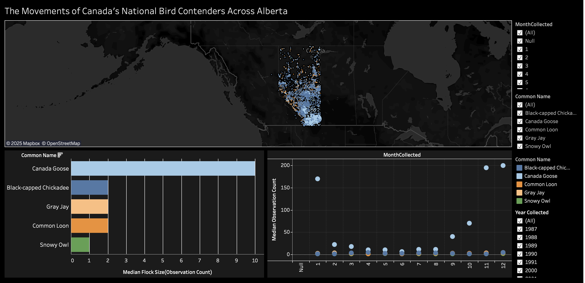
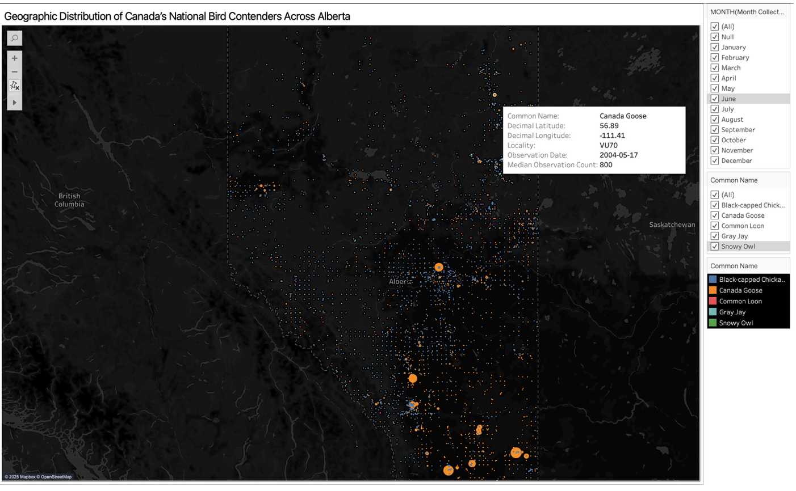
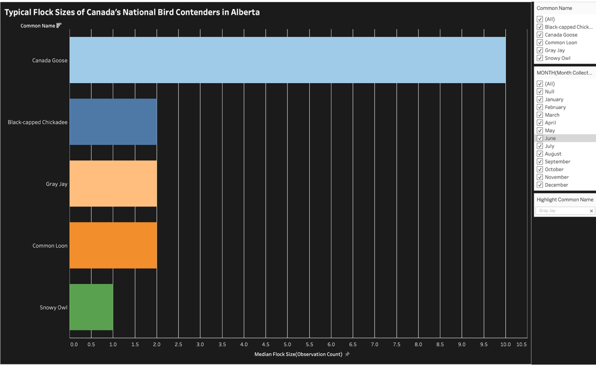
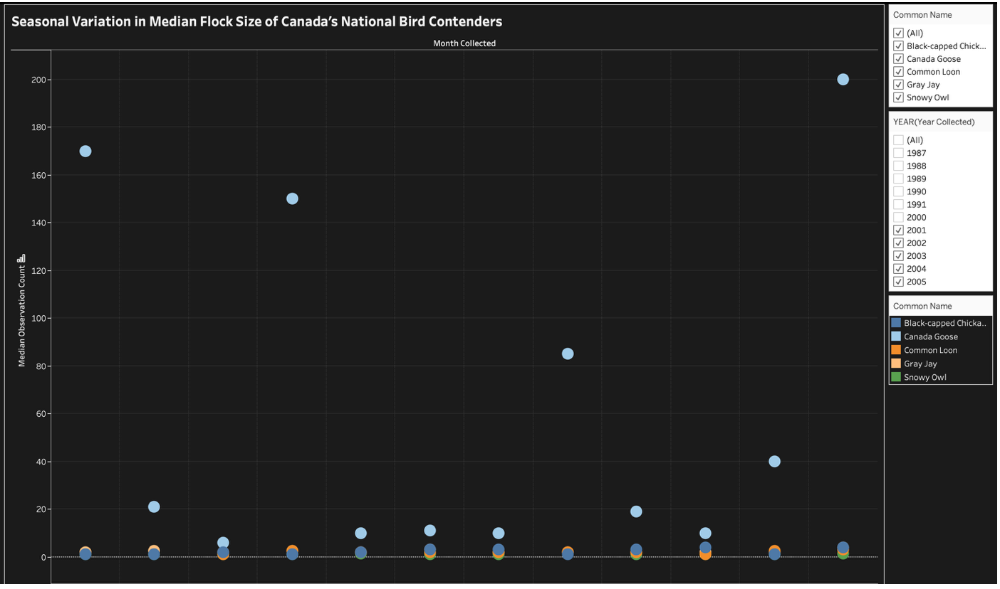

## Breeding Pairs of Canadian Birds Across Alberta  
Dataset can be found under:  
(images/dataset.csv) 

## Overview  
This dataset provides records of breeding bird pairs observed across multiple regions of Alberta between 2000 and 2020. It includes counts of nesting pairs for various bird species, with a focus on population changes, species diversity, and habitat distribution over time. The goal of these visualizations is to explore how breeding patterns have evolved across different locations and years, highlight regional differences in species abundance, and assess long-term ecological trends in Alberta’s avian populations.  

## Tools  
- Tableau & Microsoft Excel  
- Built-in Tableau features for data cleaning, filtering, and aggregation  
- Microsoft Excel for preliminary data preparation and normalization  

## Dashboard

Interactive dashboard can be found here: https://public.tableau.com/shared/K3F2Q6YRH?:display_count=n&:origin=viz_share_link

## Visualizations  

### Visualization 1  

### Visualization 2 

### Visualization 3

