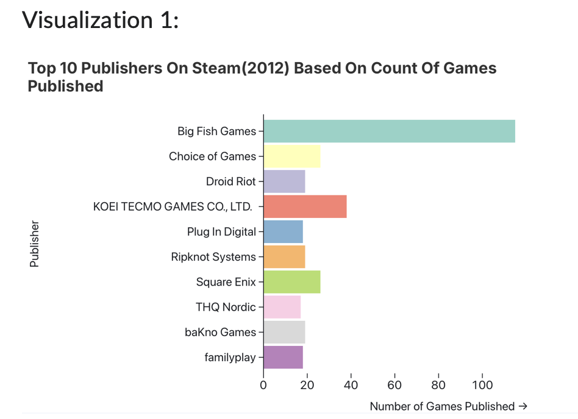
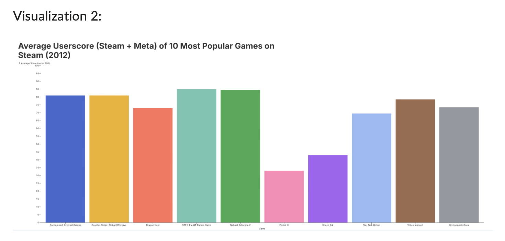
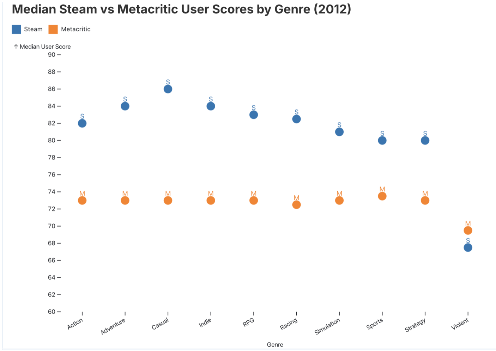
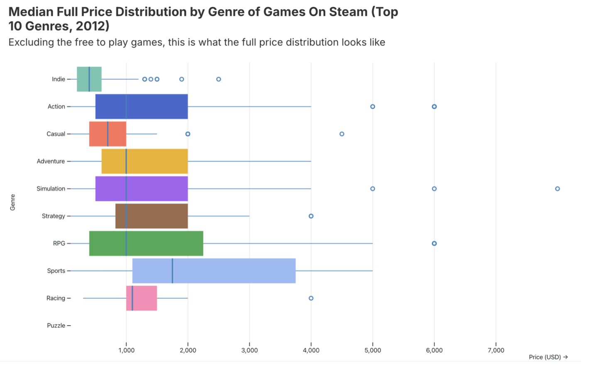
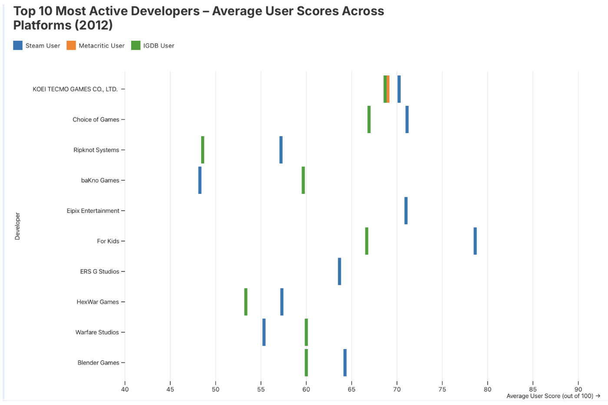

## Steam Game Ratings and Developer Performance Across Rating Platforms  (2012)
Dataset can be found under Images
(Images/dataset.csv) 

## Overview  
This dataset focuses on video games published on Steam during the year 2012, derived from a filtered version of the full Steam dataset originally compiled by leinstay. It includes information on game titles, developers, genres, release dates, and multiple rating metrics collected from Steam, Metacritic, and IGDB. The goal of this visualization exercise is to analyze developer performance and rating patterns within that year, examining how user reviews, critic evaluations, and genre preferences align or differ across platforms. Through this, we can identify which developers and genres achieved the strongest reception and how 2012 compared to broader trends in the gaming industry.
 
## Tools  
- Observable Plot and JavaScript for data visualization and interactive chart creation  
- Built-in Observable features for data filtering, grouping, and encoding  
- CSV dataset filtered to include only 2012 Steam game releases  
- Supplementary rating data integrated from Metacritic and IGDB for comparative analysis

## Visualizations  

### Visualization 1  

### Visualization 2 

### Visualization 3

### Visualization 4 

### Visualization 5 

## Insights
- Big Fish Games published the highest number of titles on Steam in 2012, releasing over 100 games, which was far more than any other publisher that year.  
- Steam user scores were consistently higher than Metacritic user ratings across most genres, suggesting that players on Steam rated games more positively than critics did.  
- The 10 most popular games of 2012, such as Counter-Strike: Global Offensive and Natural Selection 2, maintained strong average user scores above 75, indicating lasting appeal and strong community reception.  
- Genre-based price analysis showed that sports and RPG games had the highest median full prices, while casual and indie titles were the most affordable, making them more accessible to a wider audience.  
- Among the top 10 most active developers, user scores across Steam, Metacritic, and IGDB varied noticeably, showing that audience perception of game quality differed across platforms.