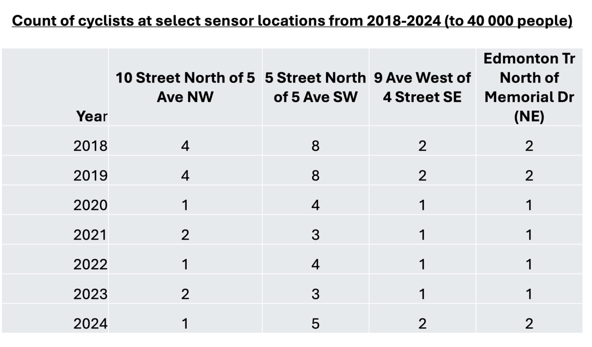
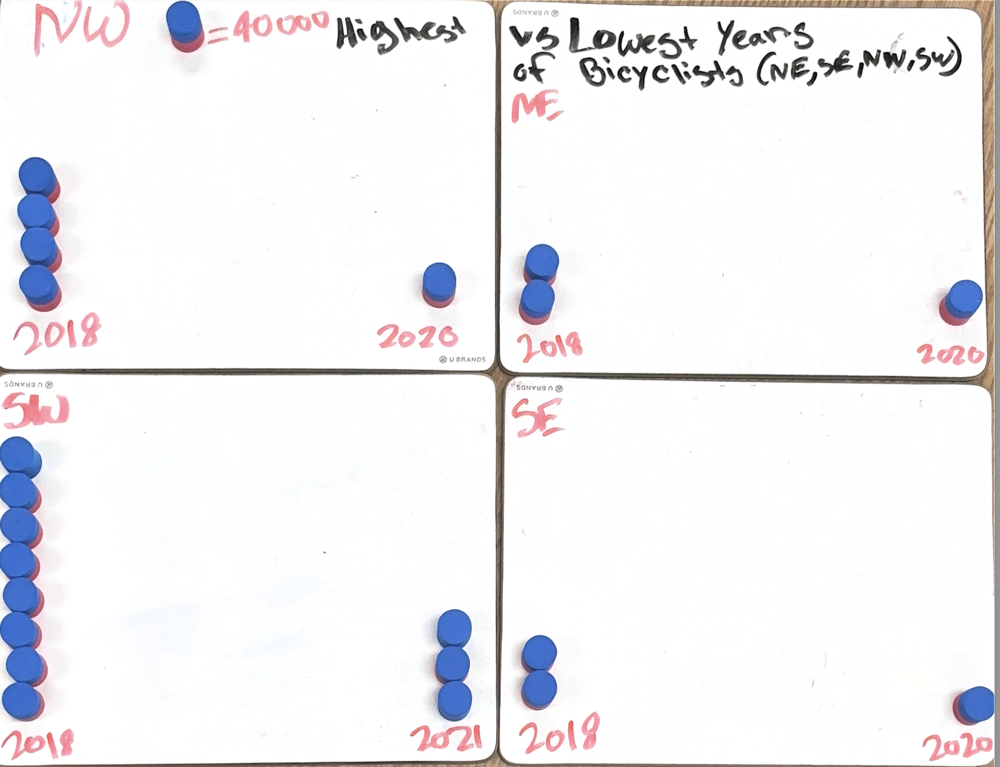
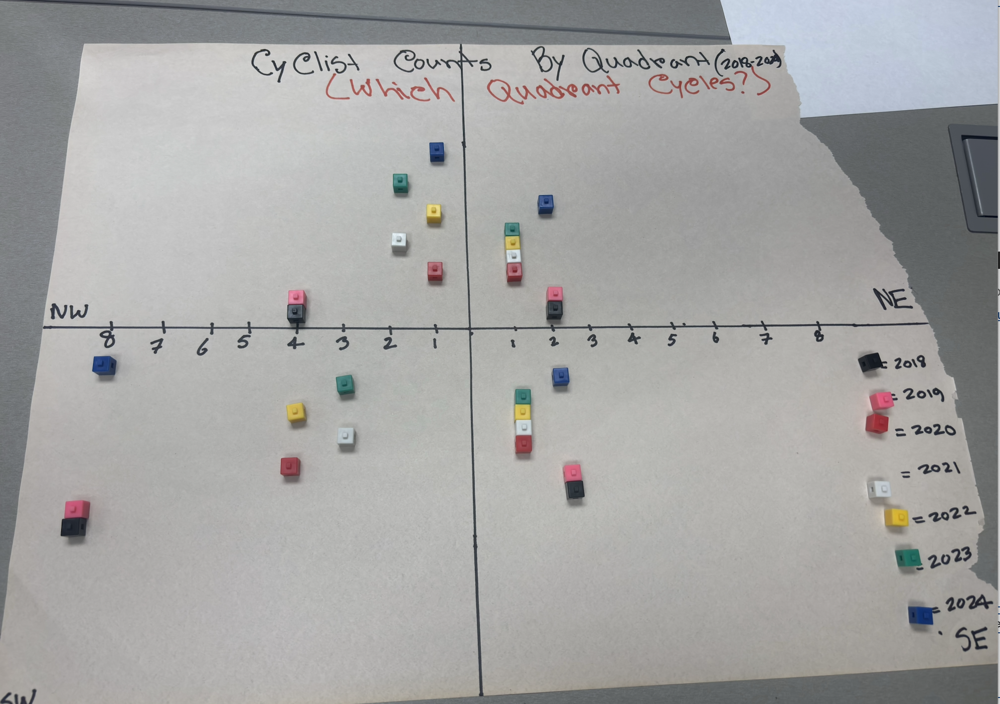

# City of Calgary Cyclist Counts(2018-2024)
  

## Overview  
The data set for this week week of class comes from The City of Calgary Open Data Portal and is drawn from the data set Bike and Pedestrian Counts which gives a sensor count of bike riders at several locations. We have included four locations in this data set. The values in the data set are groups of 40,000 cyclists.

The goal of these visualizations is to explore cyclists trends across different quadrants, highlight year-to-year changes, and compare the relative popularity of each quadrant. By presenting the data in multiple formats, the visualizations provide insights into how ridership patterns have shifted over time.  

## Tools  
- Graphing Paper
- Ruler
- Blocks
- Crafting material

## Visualizations  
### Visualization 1  

### Visualization 2 

### Visualization 3

### Visualization 4 

### Visualization 4 

## Insights  
- SW consistently has the highest amount of cyclists. 
