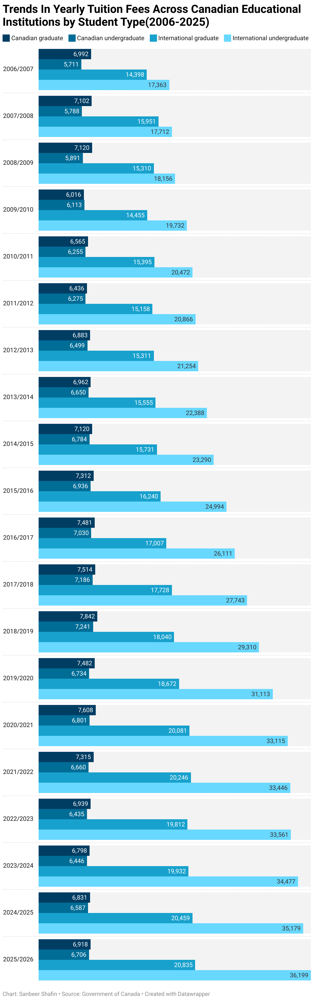
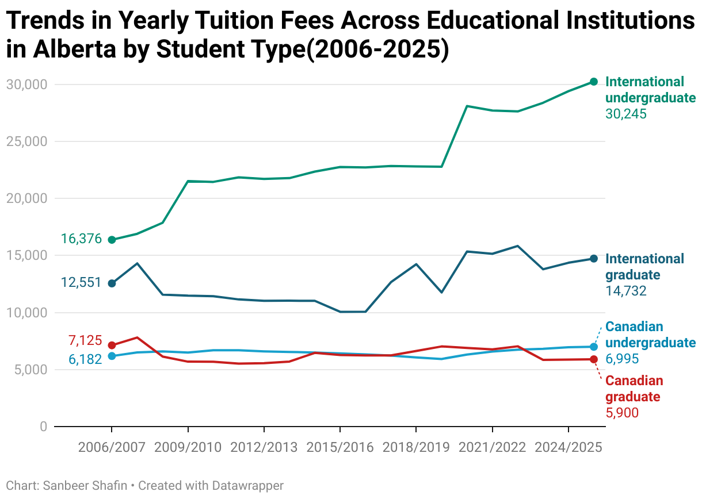
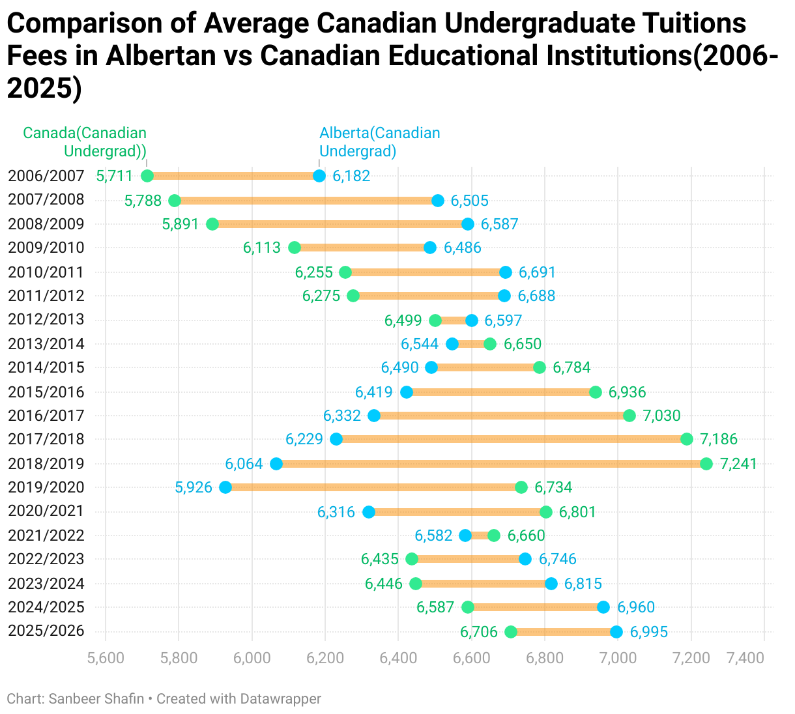
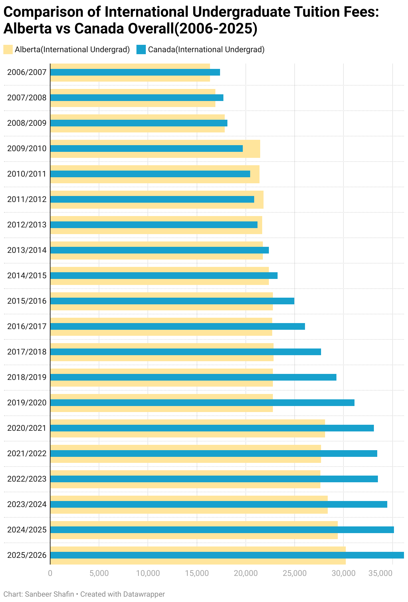
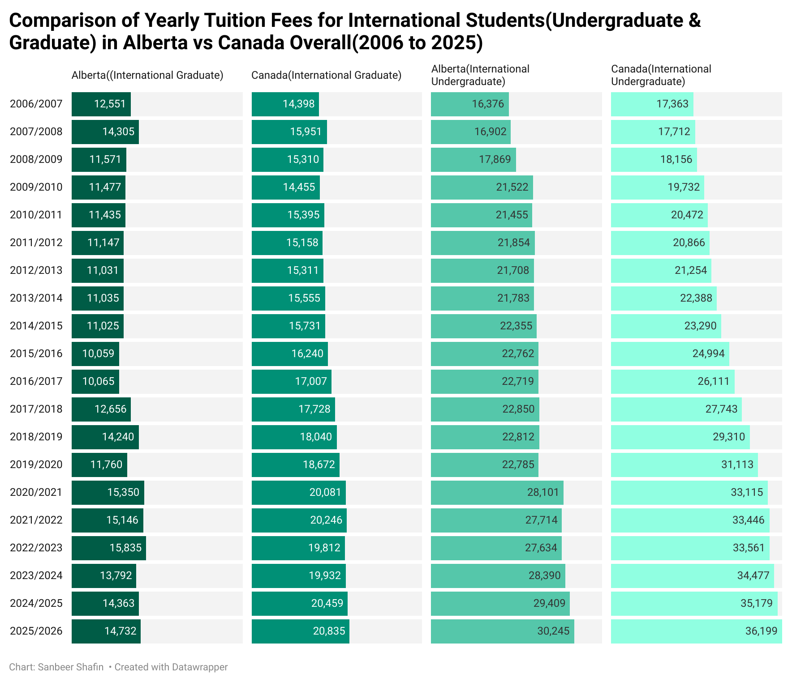

## Tuition Fees in Alberta vs. Canada By Levels of Study and Student Type (2006–2025)
Dataset can be found under Images
(Images/dataset.csv) 

## Overview  
This dataset presents the average tuition fees charged to Canadian and international students at the undergraduate and graduate levels in Alberta compared to the Canadian national average. The data spans multiple academic years and provides insight into how tuition costs vary by student type (domestic vs. international) and study level (undergraduate vs. graduate).
The purpose of these visualizations is to highlight meaningful differences and trends in tuition fees across time and location. By comparing Alberta to the Canadian average, the charts illustrate whether Alberta institutions are more affordable or more expensive for students, and how this has changed over the years.
 
## Tools  
- Datawrapper & Microsoft Excel 
- Built-in Datawrapper charting/visualization features  
- Microsoft Excel for Data Cleaning/Data Wrangling and making pviots tables. 
- Dataset provided by the Canadian Government 

## Visualizations  

### Visualization 1  

### Visualization 2 

### Visualization 3

### Visualization 4 

### Visualization 5 

## Insights  
- BHASE Programs have dominated STEM progrmas in completions.
- Education levels are steadily increasing in Alberta
- The older people get, the lesser they pursue education. 
- Most educational programs completed in Alberta are Degrees - more than Diplomas and Certificates(surprising!)
