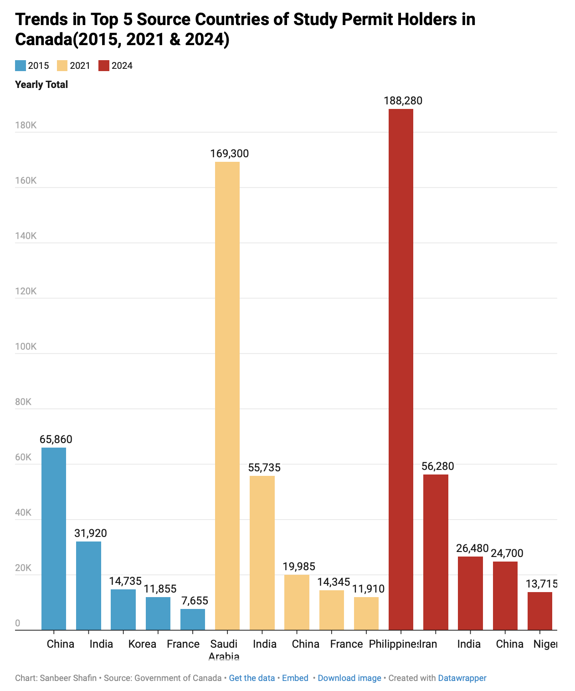
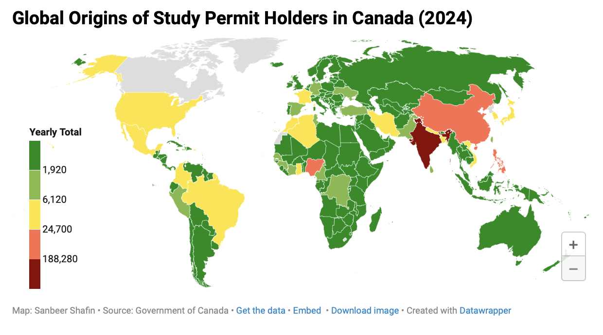
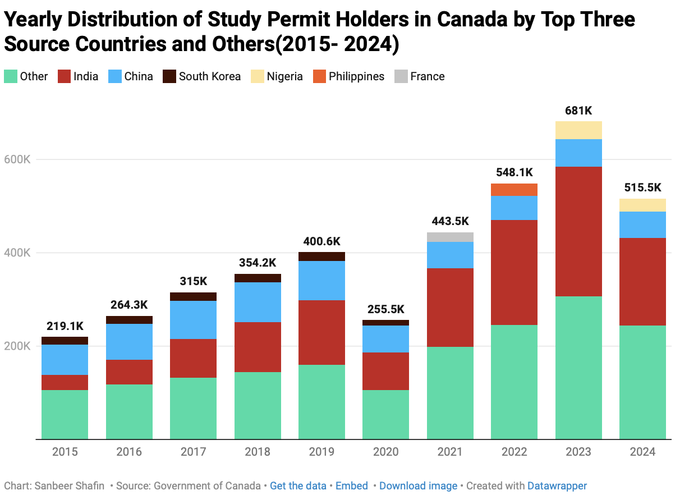
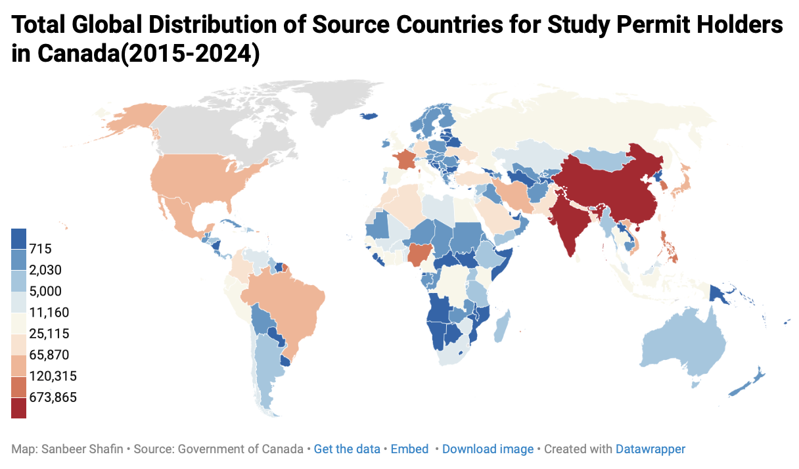
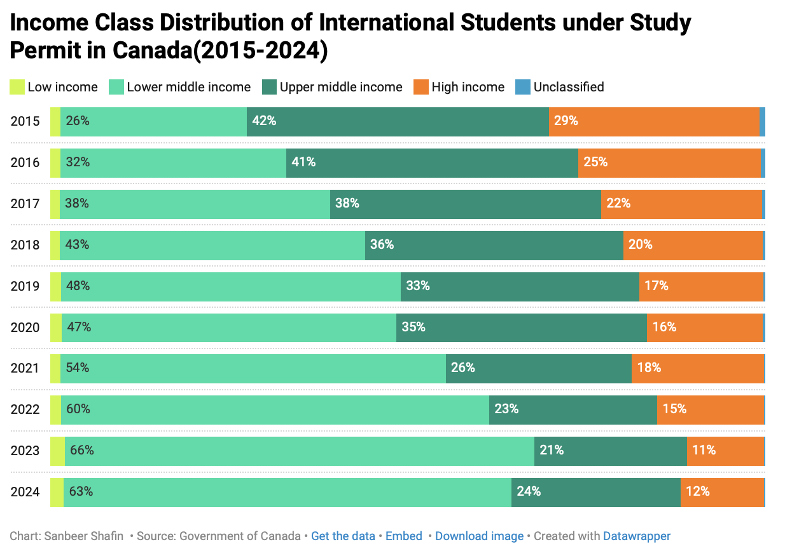

## Tuition Fees in Alberta vs. Canada By Levels of Study and Student Type (2006–2025)
Dataset can be found under Images
(Images/dataset.csv) 

## Overview  
This dataset illustrates the citizenship distribution of international students studying in Canada based on their country’s income classification, geographic region, and yearly totals of study permit holders.
It spans multiple years and highlights how international student representation has evolved over time across different world regions and economic backgrounds.
The goal of these visualizations is to explore which countries and income groups contribute the most to Canada’s international student population, how this distribution changes over time, and whether students from low- and middle-income countries are gaining or losing representation compared to those from high-income countries.
 
## Tools  
- Datawrapper & Microsoft Excel 
- Built-in Datawrapper charting/visualization features  
- Microsoft Excel for Data Cleaning/Data Wrangling and making pviots tables. 
- Dataset provided by the Canadian Government 

## Visualizations  

### Visualization 1  

### Visualization 2 

### Visualization 3

### Visualization 4 

### Visualization 5 

## Insights  
- 