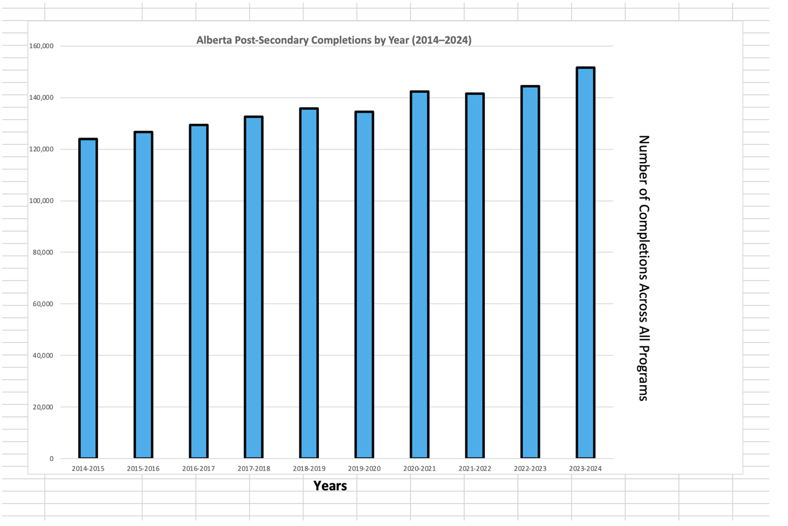
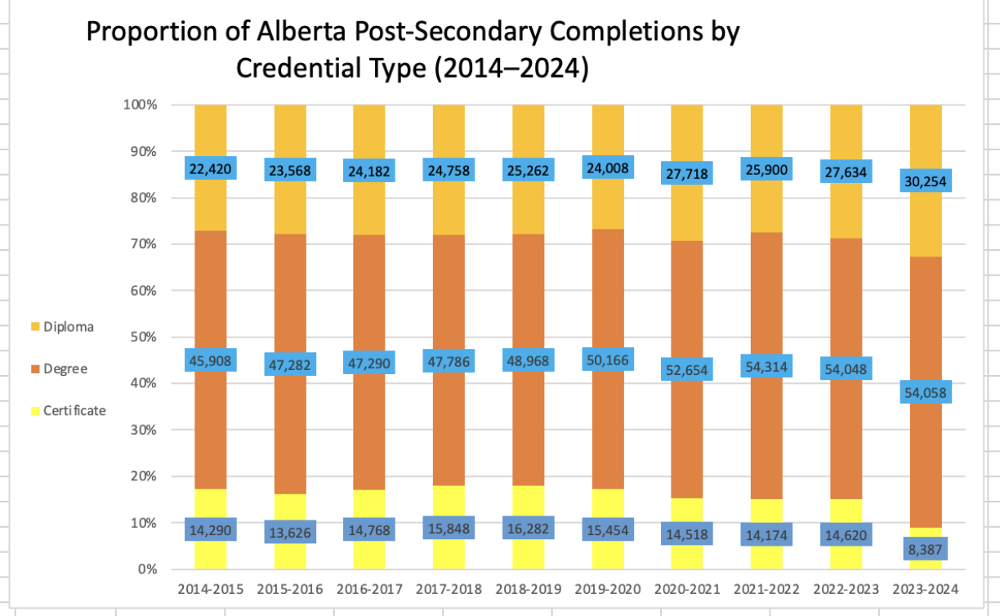
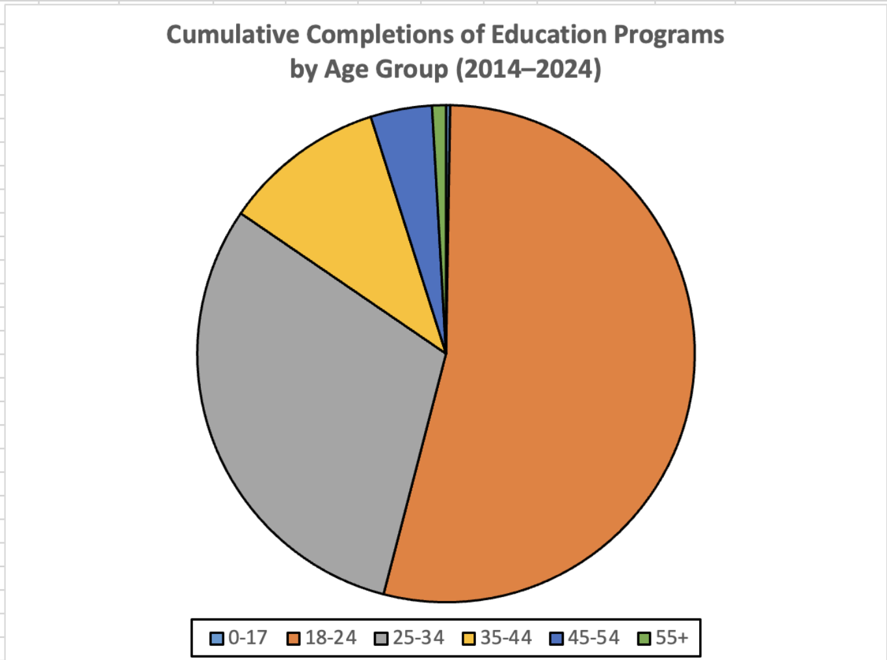
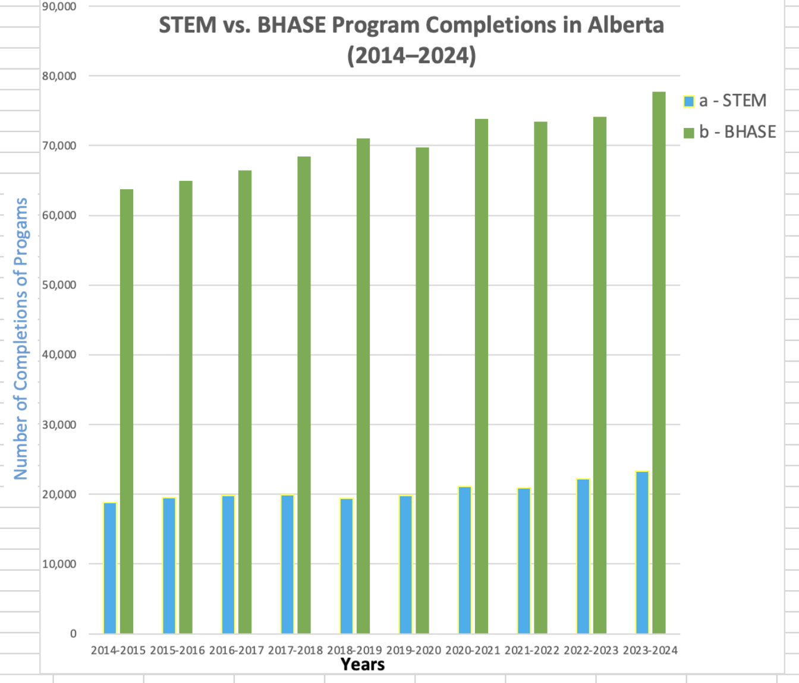
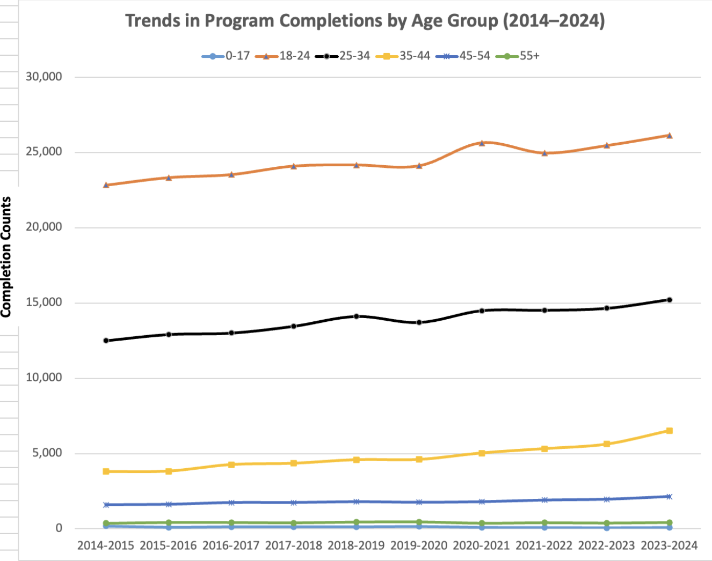

# Alberta Post-Secondary Credential Completions (2018–2024)
Dataset is found in Government of Alberta's website. 

## Overview  
This statistic describes the record count of completions by each institution and academic year within Alberta's publicly-funded post-secondary education system. Completions represent the status of the learner, at the program level, at the end of a given session. The data tables presented are related to program completions in approved credential programs at publicly-funded post-secondary institutions within Alberta. Separate data files exist focusing on the system level, or for subsets that focus on either international or self-identified Indigenous learners. - Alberta Government

The goal of these visualizations is to highlight different aspects of the dataset, showing meaningful patterns in completions across years and institutions. By presenting the data in multiple formats, the visualizations provide insights into system-wide trends and changes over time.
 
## Tools  
- Microsoft Excel  
- Built-in Excel charting/visualization features  
- Dataset provided by the Alberta Government  

## Visualizations  

### Visualization 1  

### Visualization 2 

### Visualization 3

### Visualization 4 

### Visualization 5 

## Insights  
- BHASE Programs have dominated STEM progrmas in completions.
- Education levels are steadily increasing in Alberta
- The older people get, the lesser they puruse education. 
- Most educational progrmas completed in Alberta are Degrees - more than Diplomas and Ceritficates(surprising. )
