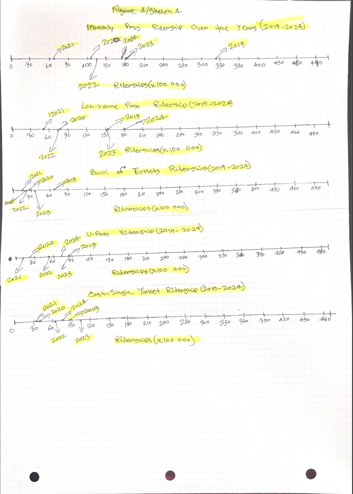

# City of Calgary Transit Riderships Over the Years
  

## Overview  
This dataset shows the total number of adult transit riders in Calgary from 2019 to 2024, aggregated by fare type and rounded to 100,000 riders. The fare categories include Monthly Pass, Low-Income Monthly Pass, Book of Tickets, U-Pass, and Cash-Single Ticket rides.  

The goal of these visualizations is to explore ridership trends across different fare types, highlight year-to-year changes, and compare the relative popularity of each category. By presenting the data in multiple formats, the visualizations provide insights into how ridership patterns have shifted over time.  

## Tools  
- Graphing Paper
- Ruler
- Pens
- Highlighter 

## Visualizations  
### Sketch 1  
  

### Sketch 2 
  

### Sketch 3
  

### Sketch 4 
 

### Sketch 5
  

## Insights  
- 2–3 short bullet points on key findings.  
