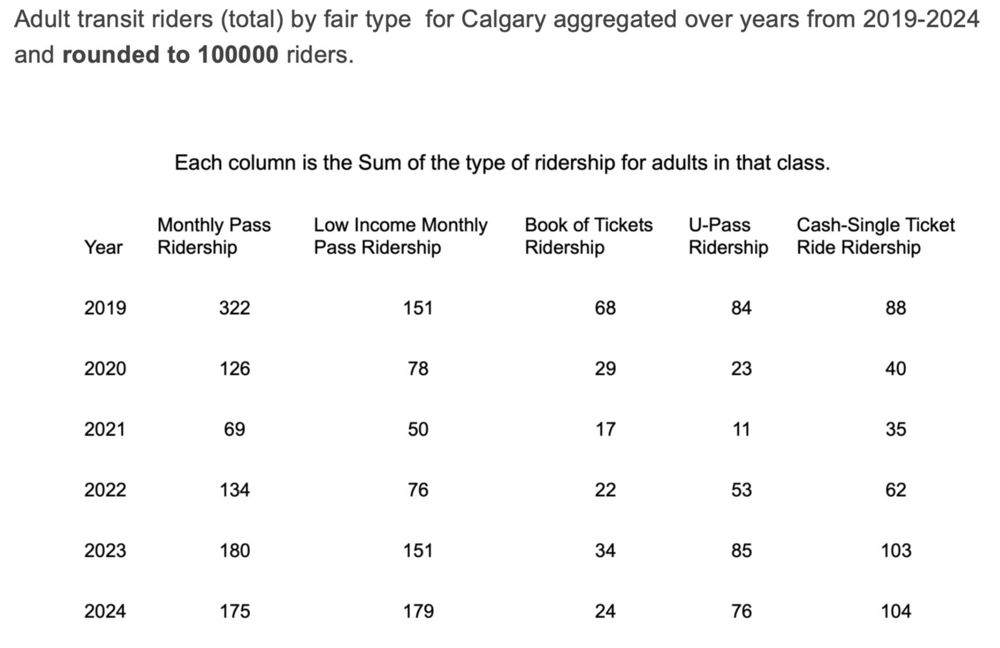

# City of Calgary Transit Riderships Over the Years
  

## Overview  
ashjdfhasd 

## Tools  
- Python (Matplotlib, Seaborn, Plotly)  
- Tableau / Power BI  
- R (ggplot2)  
- D3.js  

*(List only what you actually used.)*  

## Visualizations  
### Viz 1 – [Title]  
  

### Viz 2 – [Title]  
  

### Viz 3 – [Title]  
  

### Viz 4 – [Title]  
  

### Viz 5 – [Title]  
  

## Insights  
- 2–3 short bullet points on key findings.  
